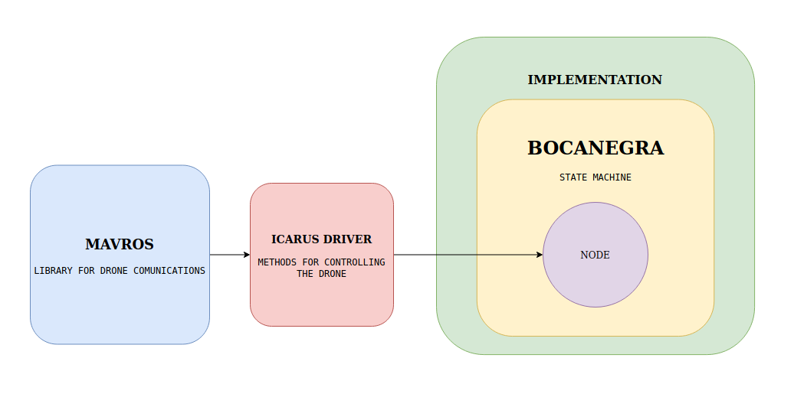
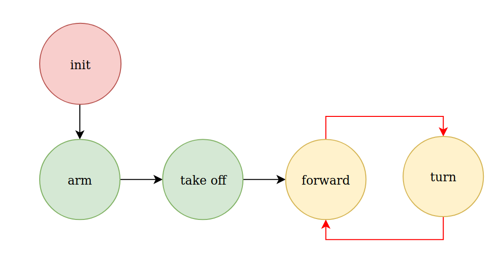
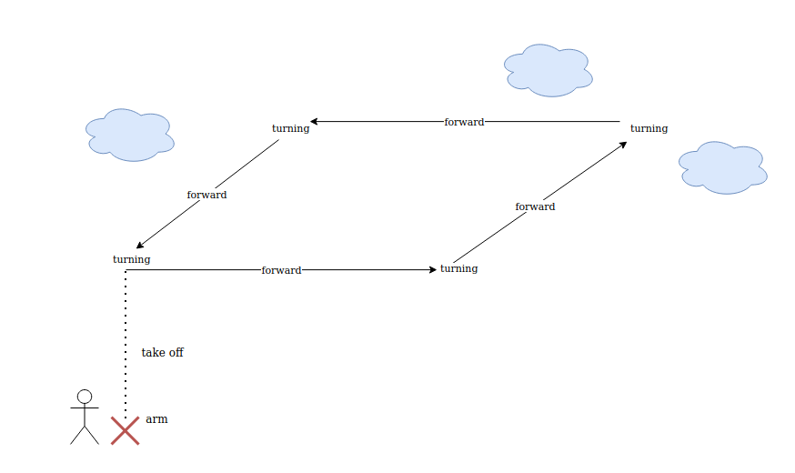

# ICARUS DRIVER

#### API of Icarus driver

| NAME  | DESCRIPTION | ACESS | FUNCTION |
| -------------| ------------- | ------------- |------------- |
| set mode  | set the mode you want to operate with the drone | `public` |`void IcarusDriver::SetMode(std::string mode)`|
| arm / disarm  | arm or disarm the drone | `public` |`void IcarusDriver::armDisarm(int arm)`|
| take off  | take off to a preorder altitude  |`public` | `void IcarusDriver::takeoff(double alt)`|
| move to local point  | move to a point in the local map | `public`|`void IcarusDriver::moveLocalTo(double x, double y,double z)`|
| turn to local point  | turn to a point in the local map | `public`|`IcarusDriver::void turnLocalTo(double roll, double pitch, double yaw);`|
| Init parameters | inicialization of parameters | `private`| `IcarusDriver::void initParams();`|
| ack notifier | notify an external serial port device |`private`|`void IcarusDriver::notifyAck(std::string msg)`|

> TODO: landing(), emergency_landing(), move_global_to()

# BOCANEGRA

Bocanegra is a state machine conceived specially for this project and addressed to give the best performace for our purpose.

  

#### API of Bocanegra state machine driver

| NAME  | DESCRIPTION | ACESS | FUNCTION |
| -------------| ------------- | ------------- |------------- |
| is active | check if a node is active  | `protected` | `bool Bocanegra::isActive()` |
| activate  | active an inactivate node | `protected` | `void Bocanegra::activate(std::string node_name)`|
| deactivate  | deactivate a node | `protected` | `void Bocanegra::deactivate(std::string node_name)`|
| states callback | give the vector of states |`private`|`void Bocanegra::statesCallback(const boca_negra_msgs::states::ConstPtr msg)`|
| is active | check if a node is active  | `private` | `bool Bocanegra::isActive(std::string node_name)` |

#### Bocanegra messages

| NAME  | DESCRIPTION | MSGS |
| -------------| ------------- | ------------- |
| node_state | msg with the node and its state |
`std_msgs/String node_name`
 
`std_msgs/Bool is_active`
|
| states  | array with all the current node_states  | `state[] array`|

#### Bocanegra services

| NAME  | DESCRIPTION | SRV |
| -------------| ------------- | ------------- |
| state_change | 
request: node_name + state

response: node_name + new state
|
`std_msgs/String node_name`
`std_msgs/Bool active`
---

`std_msgs/String node_name`

`std_msgs/Bool active`
|

#### EXAMPLE

  

  

